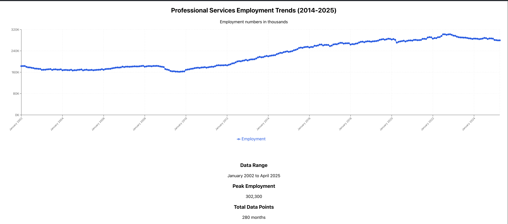

# San Jose Professional Services Employment Viewer

This project visualizes employment data for the San Jose professional and business services sector. It includes:
- A Python script to extract and filter employment data from raw CSV files.
- A React web app to display the processed data as an interactive chart.



## Getting Started

### 1. Extract Employment Data (Python)

The script `extract_employment_data.py` processes raw CSV files and extracts relevant employment data.

**Requirements:**
- Python 3.x
- pandas library (`pip install pandas`)

**Usage:**
```bash
python extract_employment_data.py ces_2002-2013_monthly_2025421.csv ces_2014-2025_monthly_2025519.csv
```
This will filter and combine data for the San Jose-Sunnyvale-Santa Clara MSA, Professional and Business Services sector. You can specify an output file by adding it as a third argument.

### 2. Run the React App

The React app (in the `employment-viewer` folder) visualizes the processed data.

**Setup:**
```bash
cd employment-viewer
npm install
```

**Start the development server:**
```bash
npm start
```
Open [http://localhost:3000](http://localhost:3000) in your browser to view the chart.

---
